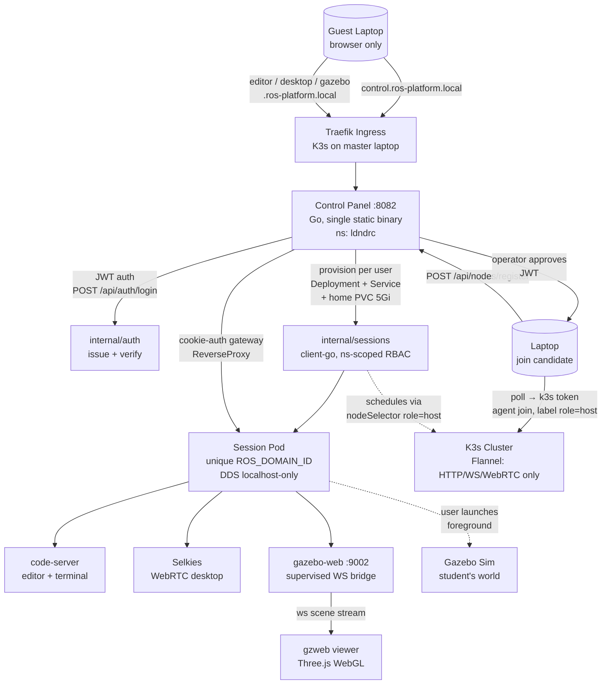
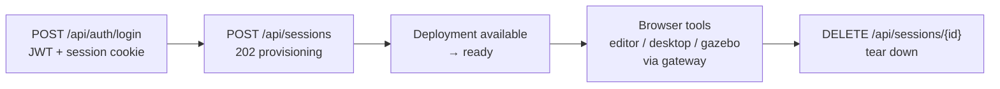

# LDNDRC — Local Dynamic Node Discovery ROS Cluster

A local-first, browser-accessible robotics simulation platform on a dynamic K3s cluster. High-end laptops (**Hosts**) contribute CPU/RAM/GPU to run isolated ROS 2 + Gazebo simulations; low-end laptops (**Guests**) act as thin clients — code, 3D sim, and desktop, all in the browser. No cloud, no dedicated server, just the LAN.

**Who does what:**

| Role | Machine | What they do |
|---|---|---|
| **Host** | Gaming/workstation laptop (≥8 cores, ≥16GB RAM, NVIDIA GPU) | Runs `./join-cluster.sh`, stays plugged in, contributes compute |
| **Guest** | Any laptop with Chrome/Firefox | Opens browser URLs, writes ROS 2 code, drives the sim — installs nothing |
| **Operator** | Master laptop (static LAN IP) | Runs K3s + control panel, approves Host join requests, manages sessions |

## Architecture

### System Overview



### Session Lifecycle



## Stack

| Layer | Technology | Purpose |
|---|---|---|
| Orchestration | K3s (lightweight Kubernetes) | Cluster state, scheduling, pod lifecycle on laptops |
| Container Runtime | Containerd | Bundled with K3s |
| Networking (CNI) | Flannel | Pod-to-pod HTTP/WebSocket/WebRTC only — DDS never leaves pod localhost |
| Ingress | Traefik (bundled in K3s) | Host-based routing to the control panel |
| GPU Management | NVIDIA GPU Operator | Driver setup + time-slicing (`replicas: 4`) on consumer GeForce GPUs |
| Auto-Discovery | `join-cluster.sh` (`TEST_*` overrides, `test-join.sh`) | Hardware gatekeeper: Host (≥8 cores, ≥16GB RAM, NVIDIA GPU) vs Guest |
| Robotics Core | ROS 2 (Jazzy) | Per-session middleware, unique `ROS_DOMAIN_ID` per pod |
| Simulation | Gazebo Sim Harmonic | Headless physics + `websocket_server` plugin on `:9002` |
| 3D Web View | gzweb (npm, Three.js WebGL) | `sim-web-app/` viewer, also usable as standalone test harness |
| Desktop Streaming | Selkies | WebRTC interactive desktop (terminal + workspace) |
| Code Editor | code-server | VS Code in the browser, persistent integrated terminals |
| Control Panel | Go (`client-go`, JWT, `net/http`) | Sessions, auth, node onboarding, WebSocket gateway — single static binary |

## Prerequisites

- **Master/operator machine:** `docker`, `kubectl`, `k3d` (for the local demo) — via `mise install go@latest kubectl@latest k3d@latest`, or system packages. Docker group membership so containers run without sudo:
  ```bash
  sudo usermod -aG docker $USER
  sudo systemctl enable --now docker
  newgrp docker   # or log out and back in
  docker ps       # must work without sudo
  ```
- **Host laptops:** Ubuntu/Debian Linux, ≥8 CPU cores, ≥16GB RAM, NVIDIA GPU (driver ≥535, 550+ recommended), ≥25GB free disk, sudo access, LAN reachability to the master.
- **Guest laptops:** only a modern browser (Chrome/Firefox with WebGL).

## Path A — Full Local Demo on One Laptop (fastest, ~10 min)

Runs the whole stack via k3d: cluster, control panel, demo session, ingress, Headlamp. Uses the tiny `demo-standin` image with `SESSION_GPU_LIMIT=0` (no GPU needed). Full runbook: `docs/local-cluster-headlamp.md`.

```bash
# 1. Create the cluster
k3d cluster create ldndrc -p "80:80@loadbalancer" -p "443:443@loadbalancer"
kubectl get nodes

# 2. Build and import images
docker build -t ldndrc/control-panel:dev ./control-panel
docker build -t ldndrc/demo-standin:dev ./images/demo-standin
k3d image import ldndrc/control-panel:dev ldndrc/demo-standin:dev -c ldndrc

# 3. Deploy the control plane
kubectl create namespace ldndrc
kubectl -n ldndrc create secret generic ldndrc-control-panel \
  --from-literal=JWT_SECRET="$(openssl rand -hex 32)"
kubectl apply -f manifests/control-panel-rbac.yaml
kubectl apply -f manifests/control-panel-deployment.yaml
kubectl apply -f manifests/control-panel-service.yaml
kubectl apply -f manifests/control-panel-ingress.yaml
kubectl -n ldndrc rollout status deployment/ldndrc-control-panel
```

Check RBAC scope (expect `yes`, `yes`, `no`):

```bash
kubectl -n ldndrc auth can-i create deployments \
  --as=system:serviceaccount:ldndrc:ldndrc-control-panel
kubectl -n ldndrc auth can-i delete persistentvolumeclaims \
  --as=system:serviceaccount:ldndrc:ldndrc-control-panel
kubectl -n ldndrc auth can-i list nodes \
  --as=system:serviceaccount:ldndrc:ldndrc-control-panel
```

Expose locally and verify:

```bash
kubectl -n ldndrc port-forward svc/ldndrc-control-panel 8082:8082 &
curl http://127.0.0.1:8082/healthz   # {"status":"ok"}
```

Create a session and test the gateway:

```bash
TOKEN=$(curl -s -X POST http://127.0.0.1:8082/api/auth/login \
  -H 'Content-Type: application/json' \
  -d '{"username":"bob","password":"secret123"}' | python3 -c "import sys,json; print(json.load(sys.stdin)['token'])")
curl -s -X POST http://127.0.0.1:8082/api/sessions -H "Authorization: Bearer $TOKEN"
kubectl -n ldndrc get pods   # session pod -> Running

# Gateway check with the login cookie (expect 200, then 401 without it):
COOKIE=$(curl -s -D - -o /dev/null -X POST http://127.0.0.1:8082/api/auth/login \
  -H 'Content-Type: application/json' \
  -d '{"username":"bob","password":"secret123"}' \
  | grep -i "^Set-Cookie:" | head -1 | sed 's/^Set-Cookie: //; s/;.*//')
curl -s -o /dev/null -w "%{http_code}\n" -H "Host: editor.ros-platform.local" -H "Cookie: $COOKIE" http://127.0.0.1:8082/
curl -s -o /dev/null -w "%{http_code}\n" -H "Host: editor.ros-platform.local" http://127.0.0.1:8082/
```

Optional — Headlamp dashboard:

```bash
kubectl apply -f manifests/headlamp.yaml
kubectl -n ldndrc port-forward svc/ldndrc-headlamp 8080:80 &
kubectl -n ldndrc create token ldndrc-headlamp --duration=24h  # paste into http://localhost:8080
```

Teardown (removes cluster, workloads, PVC data, secrets):

```bash
k3d cluster delete ldndrc
```

## Path B — Real LAN Cluster (master + Host laptops)

### 1. Master laptop (static LAN IP, e.g. `192.168.1.50`, sleep disabled)

```bash
curl -sfL https://get.k3s.io | sh -
cat /var/lib/rancher/k3s/server/node-token
```

### 2. Host laptops join (qualifying hardware joins, the rest stay Guests)

```bash
export MASTER_IP=192.168.1.50
export NODE_TOKEN=<token-from-master>
./join-cluster.sh
# High-end laptop detected. Joining as HOST.   -> installs the K3s agent, labels role=host
# Low-end laptop detected. ...                -> stays a Guest, use the browser
```

No hardware handy? Test the detection logic in ~2s without a cluster:

```bash
./test-join.sh
# or: TEST_CPU=12 TEST_RAM=16 TEST_GPU=nvidia ./join-cluster.sh
```

### 3. GPU sharing (production Hosts)

Install the NVIDIA GPU Operator, then enable time-slicing so one consumer GPU serves ~4 session pods (`plan.md` §Phase 2 has the exact ConfigMap + `ClusterPolicy` patch). Session pods request `nvidia.com/gpu: 1` each; set `SESSION_GPU_LIMIT=1` in the control-panel Deployment.

### 4. Deploy the control panel (same manifests as Path A)

```bash
kubectl create namespace ldndrc
kubectl -n ldndrc create secret generic ldndrc-control-panel \
  --from-literal=JWT_SECRET="$(openssl rand -hex 32)"
kubectl apply -f manifests/control-panel-rbac.yaml
kubectl apply -f manifests/control-panel-deployment.yaml
kubectl apply -f manifests/control-panel-service.yaml
kubectl apply -f manifests/control-panel-ingress.yaml
```

Make the four hostnames resolve to the Traefik entry point (DNS or `/etc/hosts` on Guest machines):

```text
control.ros-platform.local
editor.ros-platform.local
desktop.ros-platform.local
gazebo.ros-platform.local
```

## Operator Guide — Sessions and Nodes

### Sessions: login → provision → use → tear down

```bash
BASE=http://127.0.0.1:8082   # or http://control.ros-platform.local
TOKEN=$(curl -s -X POST $BASE/api/auth/login \
  -H 'Content-Type: application/json' \
  -d '{"username":"alice","password":"secret123"}' | python3 -c "import sys,json; print(json.load(sys.stdin)['token'])")

curl -s -X POST $BASE/api/sessions -H "Authorization: Bearer $TOKEN"   # 202, status: provisioning
curl -s $BASE/api/sessions -H "Authorization: Bearer $TOKEN"           # poll until status: ready
curl -s $BASE/api/sessions/<id> -H "Authorization: Bearer $TOKEN"      # detail
curl -s -X DELETE $BASE/api/sessions/<id> -H "Authorization: Bearer $TOKEN"  # removes Deployment+Service+PVC
```

Each session provisions a **Deployment + Service + home PVC** in the `ldndrc` namespace (created by the panel's ServiceAccount via namespace-scoped RBAC). The gateway starts routing only once the session is `ready` (Deployment reports an available replica).

### Nodes: register → approve → poll → joined

```bash
# laptop -> register (unauthenticated, rate-limited, optional JOIN_KEY)
curl -X POST $BASE/api/nodes/register -H 'Content-Type: application/json' \
  -d '{"hostname":"laptop-a","os":"linux","arch":"amd64","cpu":12,"ram_gb":32,"gpu":"NVIDIA RTX"}'
# -> {"id":"<id>","status":"pending"}

# operator -> approve or deny (JWT from /api/auth/login)
curl -X POST $BASE/api/nodes/<id>/approve -H "Authorization: Bearer $TOKEN"
curl -X POST $BASE/api/nodes/<id>/deny -H "Authorization: Bearer $TOKEN" -d '{"reason":"unknown device"}'

# laptop -> poll until approved; first poll mints the one-time K3s token
curl $BASE/api/nodes/<id>
# -> {"status":"approved","k3s_url":"https://192.168.1.50:6443","k3s_token":"K10...","node_name":"ldndrc-<id>"}
```

A 5s in-cluster watcher labels Ready nodes `role=host` and marks them `joined`. Requires the nodes RBAC, the `NODES_DB` volume, and `K3S_JOIN_URL` set to the master's reachable address — without it, approved polls answer 503. (`control-panel/README.md` has the full walkthrough.)

### Control-panel configuration (env vars)

| Variable | Default | Purpose |
|---|---|---|
| `JWT_SECRET` | — (required, exits if unset) | Signs auth tokens (24h TTL) + session cookie |
| `CONTROL_PANEL_PORT` | `8082` | Listen port |
| `SESSION_NAMESPACE` | `ldndrc` | Where session workloads are provisioned |
| `SESSION_IMAGE` | `ldndrc/ros2-gz:jazzy-harmonic-workspace` | Session image (demo deploys override to `ldndrc/demo-standin:dev`) |
| `SESSION_HOME_STORAGE` | `5Gi` | Home PVC size per session |
| `SESSION_GPU_LIMIT` | `1` | `nvidia.com/gpu` per session (`0` = schedule without GPU, for demos) |
| `NODES_DB` | `/var/lib/ldndrc/nodes.json` | Onboarding DB (emptyDir in demo; a PVC later) |
| `K3S_JOIN_URL` | — (required for onboarding) | Master's reachable address, e.g. `https://192.168.1.50:6443` |
| `COOKIE_DOMAIN` | `.ros-platform.local` | Cookie shared across all four subdomains |
| `GATEWAY_HOST_SUFFIX` | `ros-platform.local` | Host suffix the gateway routes on |
| `JOIN_KEY` | — (optional) | Pre-shared key laptops must send to register |
| `AUTO_APPROVE` | `false` | `true` auto-approves registrations (dev only) |

## Guest Guide — the Four Browser Tabs

All tool hosts go through the control panel gateway: cookie auth first, then reverse-proxy to **your** ready session's Service. `COOKIE_DOMAIN=.ros-platform.local` makes one login work everywhere.

| URL | Serves | Upstream in your pod |
|---|---|---|
| `control.ros-platform.local` | Control panel (sessions, login) | Control panel itself |
| `editor.ros-platform.local` | code-server — VS Code + terminal | port `7682` |
| `desktop.ros-platform.local` | Selkies — interactive Linux desktop (WebRTC) | port `8080` |
| `gazebo.ros-platform.local` | Gazebo 3D view (gzweb WebSocket viewer) | port `9002` |

### Your first simulation (inside the editor terminal)

```bash
turtlebot3-sim            # obstacle world (default, model: burger)
turtlebot3-sim empty      # empty world + one TurtleBot3
turtlebot3-sim house      # house world
TURTLEBOT3_MODEL=waffle_pi turtlebot3-sim house
```

Then open the **gazebo** tab — the scene streams in. Drive it from another terminal:

```bash
turtlebot3-teleop.sh
```

Rules of the road:

- **One Gazebo server per workspace.** A second `gz sim` creates a duplicate world/robot that confuses the viewer. Stop the first with `Ctrl-C`, or force-relaunch with `turtlebot3-sim --force [world]`.
- Gazebo Sim itself is **not supervised** — you launch it in the foreground so you see its logs and choose your world. `code-server`, `selkies`, and `gazebo-web` are supervised and restart on their own.
- For a custom SDF world: `gz sim -s -v 3 ~/dev_ws/src/my_workshop/worlds/maze.sdf -r`, and make sure it includes the `SceneBroadcaster` plugin so there is scene data to stream.
- Set `TURTLEBOT3_GAZEBO_GUI=true` only if you want Gazebo rendered in the IceWM desktop tab instead of the browser viewer.

Gateway errors are plain and diagnosable: `401` = log in first, `404` = no active session (create one), `503` = session still `provisioning` (wait for `ready`), `502` = session pod unhealthy (tell the operator).

## Troubleshooting

| Symptom | Meaning | Fix |
|---|---|---|
| Session pod `Pending`, `didn't match node affinity` | No node labeled `role=host` | `kubectl label node <node> node-role.kubernetes.io/role=host` |
| Session pod `Pending`, `Insufficient nvidia.com/gpu` | GPU requested, none present | Expected unless `SESSION_GPU_LIMIT=0` (demo default) |
| Session pod `ImagePullBackOff` | Image missing from nodes | Re-run `k3d image import` (Path A) or push to the registry Hosts pull from |
| Session stuck `provisioning`, gateway `503` | Deployment has no available replica yet | `kubectl -n ldndrc describe pod <session-pod>`, read events |
| Gateway `401` on tool hosts | Missing/expired cookie | Log in again at `control.ros-platform.local` |
| Gateway `502` | Session Service unreachable | Check the session pod is `Running`; `DELETE` + recreate the session |
| Node poll `503 join URL not configured` | `K3S_JOIN_URL` unset | Set it to the master's reachable `https://<ip>:6443` and redeploy |
| Port-forward dies after a rollout | Forward was tied to the old pod | Re-run the `port-forward` commands |
| `kubectl` tries `localhost:8080` | No cluster context | `k3d cluster list`; recreate if missing |
| Gazebo viewer stays blank | No scene data or bridge down | World needs `SceneBroadcaster`; check `supervisorctl status` + `/tmp/gazebo-web.err.log` in the pod; confirm `:9002` is proxied |

## Project Structure

```
├── plan.md                 # Full design doc: overview, stack, ASCII arch, phased build plan
├── onboarding-design-report.md  # Zero-touch onboarding proposal (ldndrc-join binary) — under review
├── join-cluster.sh / test-join.sh  # Host-vs-Guest hardware gatekeeper + its regression tests
├── control-panel/          # Go backend: cmd/server, internal/{auth,sessions,gateway,httpapi,nodes,join}
├── manifests/              # K3s manifests: deployment, service, ingress, RBAC, secret example, headlamp
├── images/
│   ├── workspace/          # Session image: code-server + Selkies + gazebo-web (supervised), ROS 2 + Gazebo
│   ├── base/               # Base layers
│   └── demo-standin/       # Tiny stand-in HTTP server so sessions reach `ready` without the full image
├── sim-web-app/            # gzweb WebSocket viewer (Vite test harness for the :9002 render path)
├── docs/                   # roadmap.md (done-vs-remaining map), host-joiner-tui-spec.md, local-cluster-headlamp.md
└── local_dev_docs/         # 15 build checkpoints (join logic → live K3s verification)
```

## API Reference (control panel `:8082`)

| Method | Path | Purpose |
|---|---|---|
| `POST` | `/api/auth/login` | Issue JWT + session cookie (any non-empty password today — TODO: real credential check) |
| `POST` | `/api/sessions` | Provision a workspace pod (202 `provisioning` → `ready`) |
| `GET` | `/api/sessions` | List sessions (status, node) |
| `GET` | `/api/sessions/{id}` | Session detail |
| `DELETE` | `/api/sessions/{id}` | Tear down a session |
| `POST` | `/api/nodes/register` | Laptop join request (unauthenticated, rate-limited, optional `JOIN_KEY`) |
| `GET` | `/api/nodes` | List join requests (operator, JWT) |
| `GET` | `/api/nodes/{id}` | Poll status; mints the short-lived K3s token once when approved |
| `POST` | `/api/nodes/{id}/approve` | Operator approves (JWT) |
| `POST` | `/api/nodes/{id}/deny` | Operator denies with reason (JWT) |
| `POST` | `/api/nodes/{id}/diagnostics` | Joining laptop uploads a ≤1MB diagnostics bundle |
| `GET` | `/healthz` | Liveness (`{"status":"ok"}`) |
| `WS` | `/ws/{session}` | WebSocket proxy into a pod (code-server / gzweb / Selkies) |

Host onboarding details and curl examples live in `control-panel/README.md`; the Gazebo viewer workflow lives in `sim-web-app/README.md`.

## Isolation Model

Each session pod is a **fully isolated ROS 2 environment**: all containers share one pod network namespace so DDS discovery/multicast stays on `localhost`, with a unique `ROS_DOMAIN_ID` per pod as defense-in-depth (`ROS_AUTOMATIC_DISCOVERY_RANGE=LOCALHOST` pins it further). Flannel carries only HTTP, WebSocket, and WebRTC — no DDS packet ever traverses the overlay, so cross-pod topic discovery is impossible by design. See `plan.md` §3.

## Status

Built incrementally across 15 checkpoints (`local_dev_docs/`); `docs/roadmap.md` is the done-vs-remaining map. Live on K3s with the demo stand-in image; production sessions use the full Jazzy/Harmonic workspace image with GPU (`SESSION_GPU_LIMIT=1`). The zero-touch `ldndrc-join` TUI binary (Bubble Tea, spec in `docs/host-joiner-tui-spec.md`) is a **proposal** — `join-cluster.sh` remains the current path.
