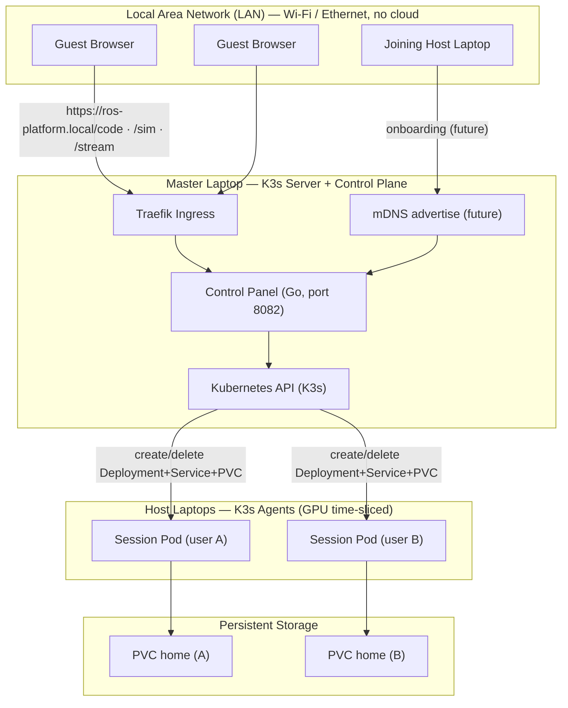
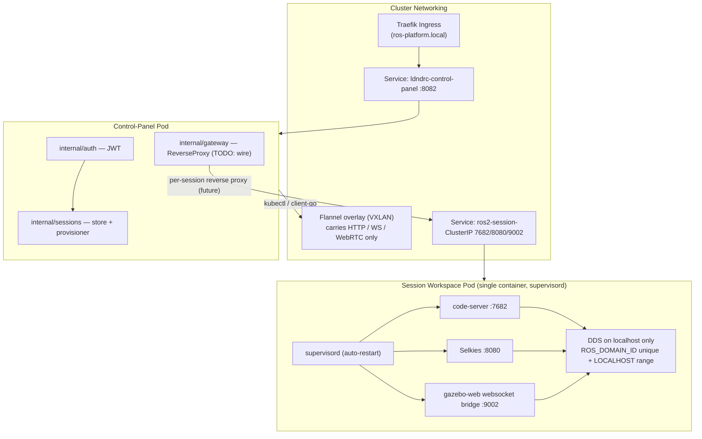
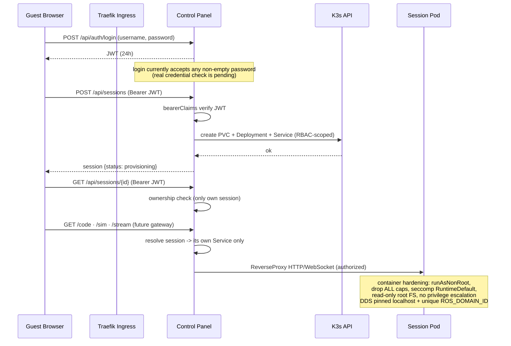
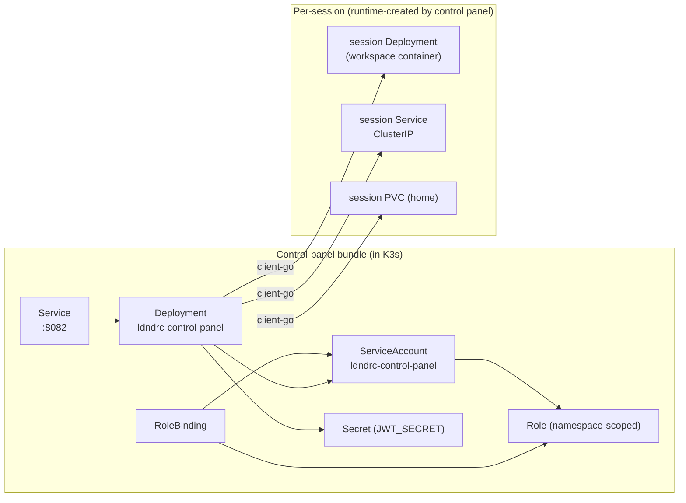

# LDNDRC System Architecture

A local-first, browser-accessible robotics simulation platform. A dynamic K3s
cluster runs across consumer laptops on a single LAN — no cloud. Strong laptops
("Hosts") run ROS 2 + Gazebo workspaces; weak laptops ("Guests") open a browser.

This document is the reference map of the whole system: what each piece does,
how data and network traffic flow, how security works, and what is built versus
still to come.

---

## 1. System Overview

**Roles:**

- **Guest laptops** — thin clients. Open a browser to write code, view the 3D
  simulation, and stream a desktop.
- **Host laptops** — contribute CPU/RAM/GPU. Run the private workspace pods.
- **Master laptop** — K3s server, Traefik ingress, and the control panel.

---

## 2. Data & Network Flow (per user session)

**Ports & protocols:**

| Tool | Port | Protocol | Direction |
|---|---|---|---|
| code-server (editor) | 7682 | HTTP | browser ↔ pod |
| Selkies (desktop) | 8080 | WebRTC (WebSocket signalling + UDP media) | browser ↔ pod |
| Gazebo websocket bridge | 9002 | WebSocket (scene data) | browser ↔ pod |
| Control panel API | 8082 | HTTP | browser ↔ control panel |
| ROS 2 DDS | localhost | UDP multicast on localhost only | inside pod only |

**Key network facts:**

- Flannel VXLAN carries only unicast HTTP/WebSocket/WebRTC traffic.
- DDS discovery and topics never leave the pod: each pod is a private ROS 2
  island (`ROS_DOMAIN_ID` unique per session, `ROS_AUTOMATIC_DISCOVERY_RANGE=LOCALHOST`).
- One private ClusterIP Service per session selects only that session's pod.

---

## 3. Security Workflow

**Security layers:**

1. **Auth** — login issues a JWT; all session API calls verify it via `bearerClaims`.
2. **Ownership** — a user can only read/delete their own session (`ErrForbidden` otherwise).
3. **RBAC** — the control panel's ServiceAccount is namespace-scoped to `ldndrc`; it can manage only Deployments, Services, PVCs, and (read) Pods. No cluster-admin.
4. **Pod hardening** — `runAsNonRoot`, dropped capabilities, `seccomp RuntimeDefault`, read-only root FS, no privilege escalation.
5. **ROS 2 isolation** — unique `ROS_DOMAIN_ID` per session + `LOCALHOST` discovery range. Cross-pod topic discovery is impossible by design.
6. **Secrets** — JWT secret injected from a Kubernetes Secret; the real Secret file is git-ignored.

---

## 4. Deployment File Map

How the deployable files connect.

| File | Kind | Role |
|---|---|---|
| `manifests/control-panel-rbac.yaml` | Namespace + ServiceAccount + Role + RoleBinding | Identity & permissions for the control panel |
| `manifests/control-panel-deployment.yaml` | Deployment | Runs the Go control panel inside K3s |
| `manifests/control-panel-service.yaml` | Service | Stable ClusterIP `:8082` for the control panel |
| `manifests/control-panel-secret.example.yaml` | Secret (template) | JWT secret shape; real value created locally |
| `control-panel/Dockerfile` | Image build | Packs the control panel into a static binary container |
| `ros2-platform.yaml` | StatefulSet (legacy) | Old shared 3-pod workspace — to be replaced |
| `ros2-service.yaml` | Service (legacy) | Old shared workspace Service — to be replaced |
| `ros2-ingress.yaml` | Ingress (legacy) | Old browser entry point — to be replaced |
| `test-pod.yaml` / `test-svc.yaml` / `test-ingress.yaml` | Test/rehearsal | Proven scheduling & routing on the k3d cluster |

---

## 5. Component Status

### Achieved ✅

| Component | Detail |
|---|---|
| Session model + one-session-per-user | `internal/sessions/store.go` |
| Ownership enforcement (403 cross-user) | `internal/sessions/store.go` |
| Session CRUD API | `internal/httpapi/router.go` |
| Per-session Deployment/Service/PVC + GPU + isolation env | `internal/sessions/kubernetes.go` |
| K3s control-panel deployment (RBAC, Deployment, Service, Secret template, Dockerfile) | `manifests/control-panel-*`, `control-panel/Dockerfile` |
| Store + Kubernetes fake-client tests | `internal/sessions/*_test.go` |
| Checkpoint reports | `local_dev_docs/checkpoint-01..06` |

### Remaining 🔲

| Component | Notes |
|---|---|
| Gateway routing to per-session Services (`/code`,`/sim`,`/stream`) | `gateway.go` is a stub; not wired to session resolution |
| Status reconciliation (`provisioning` → `ready`) | store stays `provisioning` after apply |
| Real login credential check | currently any non-empty password |
| Frontend (`/login`, `/launch`, `/app`, `/desktop`) | only `uiux-design.md`; `control-panel/web/` empty |
| Zero-touch onboarding (`ldndrc-join`, mDNS, approval dashboard) | designed in `onboarding-design-report.md` |
| Replace legacy `ros2-*.yaml` path | still points to shared `ros2-platform-svc` |
| Real K3s deployment verification | needs Go + kubectl + built images |
| TLS / NetworkPolicy / observability | flagged in reports |
| Persistent-storage end-to-end exercise | PVC created, not yet tested on a live cluster |

### Partial 🟡

| Component | Notes |
|---|---|
| Persistent storage | PVC created per session, not yet exercised end-to-end |

---

## 6. How to read this document

- **Green / ✅** = already built in this repository.
- **Yellow / 🟡** = scaffolded but not fully verified.
- **Red / 🔲** = designed or pending, not yet implemented.

This document is a living reference. Keep it updated as chunks are completed.