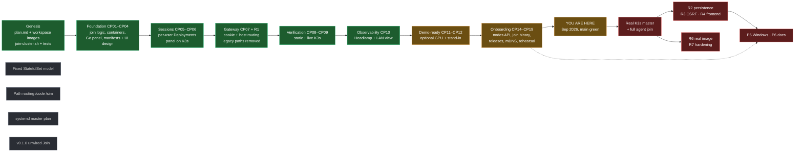
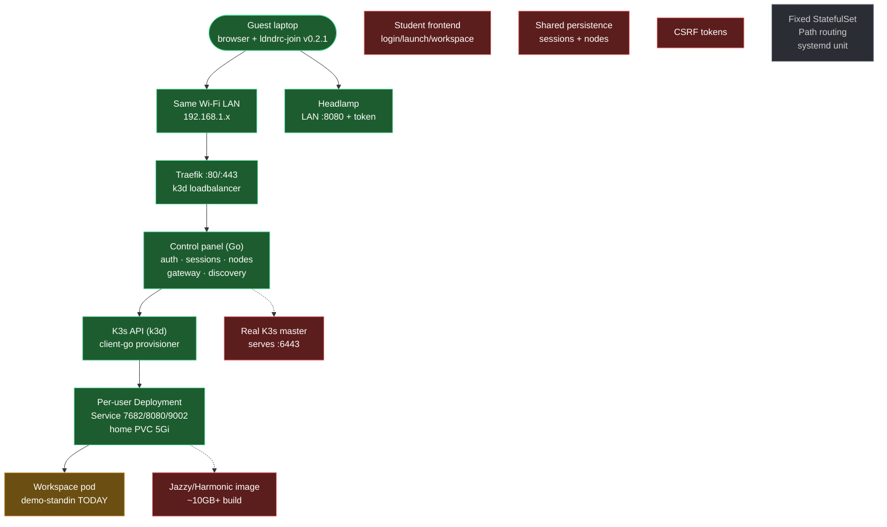
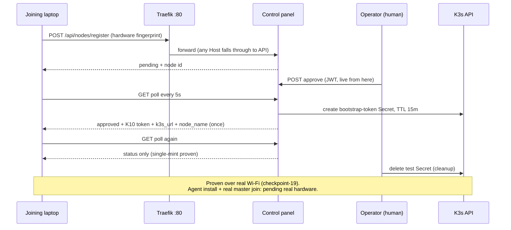

# LDNDRC Project Journey — Done vs Remaining (Visual Report)

> Companion to `docs/roadmap.md` (R-item tracker) and
> `local_dev_docs/detailed-project-report.md` (technical inventory). This
> document is the *visual journey* layer: where we started, every era we
> passed through, what is live today, and what remains — as coloured
> workflow diagrams with ASCII fallbacks (Mermaid renders on GitHub/GitLab).

## Colour legend (used in every diagram)

| Colour | Meaning |
|---|---|
| Green | Built **and** verified live on the cluster or real hardware |
| Amber | Built but provisional — simulated, demo-scoped, or awaiting hardware proof |
| Red | Missing or blocked — real remaining work |
| Grey | Removed or superseded along the way |

## 1. The journey flowchart (start → today → remaining)



```text
ASCII fallback:

plan.md/genesis -> CP01-04 foundation -> CP05-06 sessions -> CP07+R1 gateway
  -> CP08-09 verification -> CP10 observability -> CP11-12 demo-ready
  -> CP14-19 onboarding => YOU ARE HERE
  => real-master join => R2/R3/R4 features (+ P5/P6 alongside) => R6/R7
Removed along the way: StatefulSet model, path routing, systemd plan, v0.1.0
```

**Era notes (one line each).** Genesis: design docs, ROS/Gazebo image
recipes, the bash join gatekeeper with its 4-scenario exam. Foundation:
Go control panel skeleton, manifests, UI/UX design. Sessions: per-user
Deployment/Service/PVC with unique ROS domains, panel deployed on K3s.
Gateway: cookie auth + host-subdomain routing, legacy paths deleted after
live proof. Verification: static suite green, then the first live-K3s
proofs. Observability: Headlamp in-cluster, viewed from the guest laptop
over LAN. Demo-ready: GPU made optional, 82MB stand-in image proves the
ready path. Onboarding: nodes API, join binary + TUI, three releases,
mDNS advertiser, wired Join screen, first real laptop-to-master handshake.

## 2. System architecture map (live state, Sep 2026)



```text
ASCII fallback:

Guest laptop --LAN--> Traefik :80 --> control panel --> K3s API
    --> per-user Deployment/Service/PVC --> workspace pod (stand-in TODAY)
Guest --> Headlamp :8080 (operator view, token-gated)
Missing: real master :6443, real workspace image, student frontend,
  shared persistence, CSRF. Removed: StatefulSet model, path routing, systemd.
```

Live snapshot backing this map: control-panel, headlamp, and Bob's demo
session pods all 1/1 Running; per-session Service with 7682/8080/9002 and
bound 5Gi PVC; Traefik ingress on all four hostnames; LAN forwards `:8082`
(API) and `:8080` (Headlamp); gateway verified editor-200 / desktop-502 /
no-cookie-401; nothing listens on `:6443` (k3d API is localhost-only).

## 3. Onboarding swimlane (as built and proven)



```text
ASCII fallback:

laptop --register--> master (pending + id) | operator approves
  | laptop polls --> master mints one 15-min token --> token once
  | later polls --> status only | operator deletes test secret.
Proven on real Wi-Fi; agent install awaits a real K3s master.
```

Colour status of this flow: register/approve/mint/cleanup green (live);
TUI-driven variant amber (wired + unit-tested, rehearsal pending second
terminal); agent install + watcher-joined red (needs real master).

## 4. Verification ledger (claim → proof → observed output)

| Claim | How proven | Observed |
|---|---|---|
| One workspace per user, isolated | Unit + live: two users, distinct Deployments/Services/PVCs, ROS domains 100/101, owner-scoped lists | `kubectl get` shows separate resources; cross-user access 403 |
| Gateway routes correctly | Live via Traefik with Host headers | editor 200 (stand-in body), desktop/gazebo 502 by design, no-cookie 401, unready 503, old `/code` 404 |
| Scheduler enforces Host + GPU rules | Live scheduler events | affinity refusal unlabeled; `Insufficient nvidia.com/gpu` on GPU-less node; schedules when GPU optional |
| Sessions clean up fully | Live delete | Deployment + Service + PVC all gone; other user's untouched |
| Bootstrap tokens mint once | Live across real Wi-Fi | one Secret (correct type/expiry/groups/description), second poll token-free, zero left after cleanup |
| Join binary parity | `--plain` vs `test-join.sh` | byte-for-byte on all 4 scenarios; shell suite 4/4 |
| TUI quits + transitions | Unit + pty run | `q` exits 0 with bye; keypress matrix green; cross-compiles 3 OSes (~7.5MB) |
| mDNS announce→find | Unit round trip | passes; LAN proof needs real master (advertiser off in k3d by design) |
| Releases installable | Fresh download each tag | checksum OK; binary runs first try on guest |
| RBAC least privilege | Live `auth can-i` probes | session rights yes; node reads no (base); minter/watcher rights yes |

## 5. Decisions + debt register

Pivots (each with its rationale recorded in checkpoints): Go over NestJS;
per-session resources over fixed StatefulSet; cookie+hosts over paths
(R1); in-cluster Deployment over root systemd (report amended); bootstrap
Secrets over CLI-minted tokens; conditional GPU over faked capacity;
stand-in scoped to plumbing proof; Bubble Tea over heavy UI frameworks;
darwin guest-only; no silent installs and no Guest overrides (locked D1/D4);
plain Actions releases; `MASTER_IP` required, never defaulted.

Known debt (all acknowledged, none hidden): in-memory/emptyDir stores
orphan resources on restart (R2 will subsume nodes JSON too); stand-in is
not a workspace (R6); no student frontend (R4); no TLS/CSRF (R3/security);
`K3S_JOIN_URL` rehearsal value; no real master join yet; Windows/WSL2 and
LAN-mDNS unproven on hardware; legacy `join-cluster.sh` still the only
complete join path.

## 6. Remaining work funnel (ordered, with dependencies)

1. **Paired TUI rehearsal** — second terminal drives the wired Join screen
   through approval + token receipt; abort at sudo prompt (no installs).
2. **Real K3s master + full agent join** — unblocks `:6443`, watcher-joined,
   P2 LAN-mDNS proof, session scheduling on new node.
3. **R3 CSRF → R2 persistence → R4 frontend** — secure, durable, visible.
4. **P5 Windows/WSL2 + P6 deprecation/docs.**
5. **R6 real image on GPU hardware → R7 hardening** (TLS, quotas, policy,
   observability).

Guide: finish items top-down; each row's proof is a checkpoint report in
`local_dev_docs/`; move the roadmap's YOU-ARE-HERE marker as rows land.
Related docs: `docs/roadmap.md` (R-tracker), `local_dev_docs/`
(CP01–CP19 stories), `docs/local-cluster-headlamp.md` (runbook).
