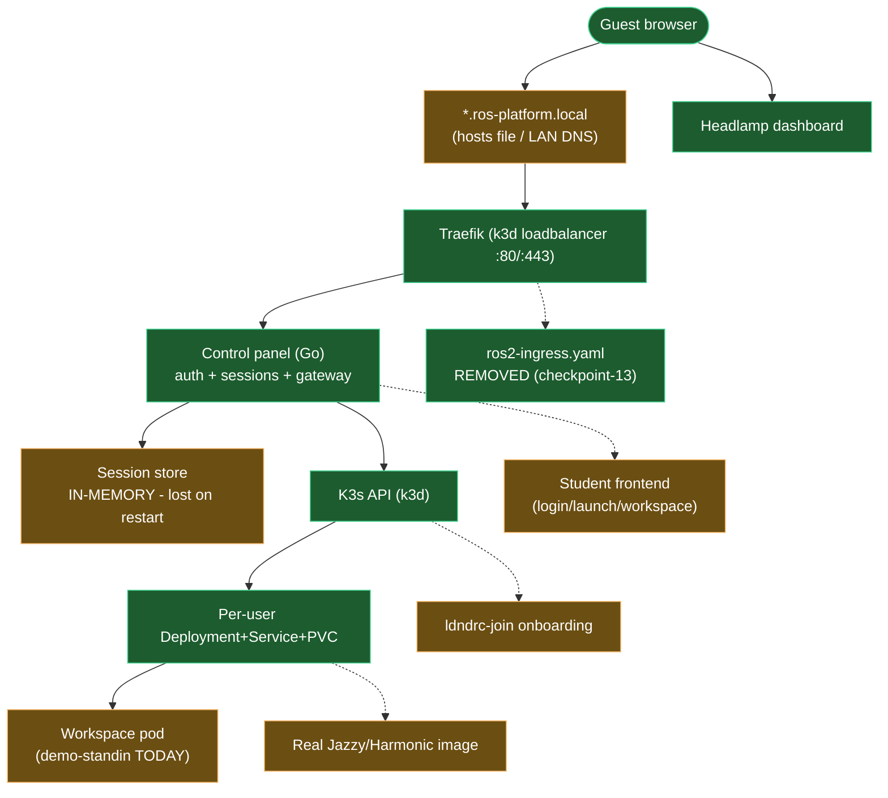

# LDNDRC Roadmap — Done vs Remaining (Visual Guide)

> How to read this doc: **§1 is the map** (done = green, remaining = amber,
> blocked/heavy = red). **§2 explains every remaining item** in build order
> with acceptance criteria. **§3 is the suggested sequence** with effort
> estimates. Mermaid diagrams render on GitHub/GitLab; an ASCII fallback
> follows each one.

## 1. The Map

### 1a. Build journey (where we are)


```text
ASCII fallback (CP = done checkpoint, Rn = remaining item):

CP01 -> CP02 -> CP03 -> CP04 -> CP05 -> CP06 -> CP07 -> CP08 -> CP09 -> CP10 -> CP11 -> CP12
                                                                                        |
                                                                                   YOU ARE HERE
                                                                                        |
                           R1 -> R2 -> R3 -> R4 -> R5 -> R6 (heavy, parallel) -> R7
```

### 1b. System map (what exists vs what is missing)



Legend:

| Color | Meaning |
|---|---|
| Green | Built, deployed, verified live |
| Amber | Missing or provisional — real remaining work |
| Red | Legacy — works but scheduled for removal (none left after R1) |

## 2. Remaining Work in Detail

### R1 — Remove legacy ingress (done in checkpoint-13)

`manifests/ros2-ingress.yaml` routed `/code`, `/stream`, `/sim` on the
bare hostname to the old shared `ros2-platform-svc`. Host-based routing
(CP07, proven live in CP09/CP12) replaced it, so the ingress, the shared
Service (`ros2-service.yaml`), and the fixed StatefulSet
(`ros2-platform.yaml`) were deleted. Verified: only the control-panel
ingress exists live, gateway hosts keep their proven 200/502/401 pattern,
and the old `/code` path 404s.

### R2 — Session persistence (medium, observed pain twice)

The store is in-memory: every control-panel restart wipes sessions and
orphans their K3s resources (seen live in CP09 and CP11, cleaned by hand).

- Persist sessions (JSON file like the onboarding design's node store, or SQLite/Postgres later) and reconcile on boot: adopt matching live resources, mark the rest for cleanup.
- Verify: restart control panel → sessions survive → gateway still routes → no orphans in `kubectl get`.
- Effort: half a day (file store) to days (DB + migration).

### R3 — CSRF protection (small–medium, reference parity)

The reference project requires a CSRF token on mutating browser requests;
our cookie API currently does not. Any site the student visits could POST to
our API with their cookie attached.

- Issue CSRF token at login, require `X-CSRF-Token` header on POST/DELETE session routes, keep bearer-token API path unchanged.
- Verify: unit tests (missing/invalid token → 401/403), live check via curl.
- Effort: half a day.

### R4 — Student frontend UI (large, design exists)

`uiux-design.md` specifies login → launch stepper → workspace shell
(Code/Sim/Split views) as a React+Vite SPA embedded in the Go binary via
`embed.FS`. Nothing is built yet; the API it needs is verified live.

- Scaffold `control-panel/web/`, wire JWT + cookie auth, session CRUD polling, iframe embedding of editor/desktop, gzweb component for sim.
- Verify phase-wise: UI-1 login+launch, UI-2 workspace shell, UI-3 admin view (matches the design doc's phasing).
- Effort: days to a week.

### R5 — Host onboarding `ldndrc-join` (large, design ready)

`onboarding-design-report.md` (amended 2026-09-06 for the in-cluster control
panel) specifies the zero-touch flow: mDNS discovery, nodes register/approve
API, short-lived bootstrap tokens via client-go, cross-platform join binary.
Today only the manual `join-cluster.sh` path exists. Approval dashboard UI
is deferred until the R4 frontend lands — P1 approval is API/`curl`-driven.

- Implement in the report's phase order — **P1 nodes API done
  (checkpoint-14), P2 advertise done (checkpoint-17)**; P4 join binary,
  P5–P6 next — keeping the bash path until the Go binary is proven on
  real hardware.
- Verify: a real second laptop joins as Host, appears Ready with the Host
  label, and schedules session pods; denial path tested too.
- Effort: several days; needs a second physical machine for the real proof.

### R6 — Real workspace image (heavy, needs hardware)

The `demo-standin` proves plumbing only. The true workspace (ROS2 Jazzy +
Gazebo Harmonic + code-server + Selkies, per `images/`) is a ~10GB+ build
and needs a GPU host to shine.

- Build `images/base` → `images/workspace` on a machine with disk and time;
  import into the cluster; flip `SESSION_IMAGE` back from the stand-in.
- Verify: session reaches `ready` with real services on 7682/8080/9002;
  gateway editor/desktop/sim all 200; TurtleBot3 sim streams.
- Effort: a day of build babysitting; full value only on GPU hardware.

### R7 — Production hardening (ongoing track)

TLS/mTLS on the control panel API, NetworkPolicies isolating session pods,
Prometheus/Grafana observability, log aggregation, resource quotas. Each is
independently shippable; start with TLS + quotas when leaving the LAN-demo
stage.

## 3. Suggested Sequence

| Step | Item | Why here | Effort |
|---|---|---|---|
| 1 | ~~R1 legacy ingress removal~~ done (checkpoint-13) | Cleanup complete | < 1h |
| 2 | R3 CSRF protection | Small, closes a real browser-threat hole | 0.5 day |
| 3 | R2 session persistence | Medium; stops the restart-orphan pain | 0.5–2 days |
| 4 | R4 student frontend | Large but fully unblocked by the verified API | days |
| 5 | R5 host onboarding | Needs a second physical laptop | days |
| 6 | R7 hardening | As you approach real users | ongoing |
| ∥ | R6 real image (parallel) | Heavy; run alongside whenever hardware/disk allow | 1+ day |

Guide for contributors: pick the topmost unfinished row, read its section in
§2, implement, verify with the listed checks, then record a checkpoint report
in `local_dev_docs/` following the CP01–CP12 format. Update this map's
"YOU ARE HERE" marker as items land.